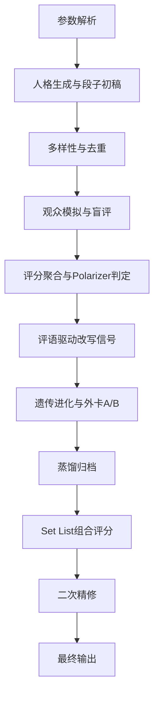

# Comedy Forge 运行机制论文式说明

## 摘要

本文系统化描述 Comedy Forge 的运行机制。该系统以“协议驱动”的方式完成喜剧内容生成、观众模拟、评分进化、评语驱动改写与演出级组装。与传统一次性文本生成不同，Comedy Forge 将创作过程建模为受约束的多轮优化问题：在保证人格多样性、评审隔离与风格一致性的前提下，最大化段子质量与整场演出连贯性。本文给出核心数据结构、关键算法、约束系统、目标函数与复杂度分析，作为工程实现与复现的统一参考。

**关键词**：喜剧生成、协议化智能体、观众模拟、遗传进化、评语驱动改写、Set List 优化

---

## 1. 引言

脱口秀/漫才创作存在三个典型难点：

1. 单轮生成质量不稳定，难以形成可演出稿。
2. 缺少观众结构化反馈回路，改写方向依赖主观直觉。
3. 段子“单体质量”与“整场编排质量”常常冲突。

Comedy Forge 的目标不是“单条最好笑”，而是“多轮收敛到可演出的整场集合”。

---

## 2. 问题定义

### 2.1 输入空间

定义输入参数：

\[
\Theta = \{type, theme, min\_rounds, max\_rounds, survival\_rate, batch\_size, audience\_size, absurd\_booster\}
\]

约束范围：

- `type ∈ {standup, manzai, auto}`
- `3 ≤ min_rounds ≤ 20`
- `5 ≤ max_rounds ≤ 30`
- `0.1 ≤ survival_rate ≤ 0.5`
- `10 ≤ batch_size ≤ 500`
- `10 ≤ audience_size ≤ 200`
- `3 ≤ absurd_booster ≤ 50`

### 2.2 输出目标

输出为 Markdown 演出稿：

- 人格画像
- 进化树日志
- Top 6-8 演出清单
- X 区实验段
- 评语驱动改写日志

### 2.3 优化目标

最终目标可写作：

\[
\max \; \mathcal{J} = \alpha \cdot Q_{joke} + \beta \cdot Q_{set} + \gamma \cdot Q_{diversity} - \lambda \cdot R_{redundancy}
\]

其中：

- \(Q_{joke}\)：单条段子质量
- \(Q_{set}\)：整场编排质量
- \(Q_{diversity}\)：多样性覆盖
- \(R_{redundancy}\)：同构冗余风险

---

## 3. 系统总线与执行序

### 3.1 协议层

- `system/persona-generator.md`
- `system/scoring-protocol.md`
- `system/comment-rewrite-rules.md`
- `system/evolution-rules.md`
- `system/batch-diversity.md`

### 3.2 工作流层

- `workflows/batch-creator.md`
- `workflows/audience-simulator.md`
- `workflows/distillation-engine.md`
- `workflows/final-assembly.md`

### 3.3 执行链路

---

## 4. 人格生成算法

### 4.1 两层人格结构

每条段子人格由：

1. **常量基线**：行业敬畏、观众尊重、实战经验、方法论内化。
2. **8维变量**：身份、代际、性格、认知滤镜、语言风格、隐藏秘密、当下状态、主题关系。

### 4.2 约束采样

对 batch 内人格执行约束满足：

- 身份覆盖 \(\ge 4\) 类
- 认知滤镜覆盖 \(\ge 5\) 类
- 单一代际占比 \(\le 50\%\)
- 相邻语言风格不可相同

### 4.3 新血差异度

新血需与精英池保持认知差异：

\[
distance(new, elites) = 1 - \max_{e \in elites} sim(new, e) > 0.5
\]

---

## 5. 观众模拟与情绪种子

### 5.1 12维观众向量

观众按权重分层采样：

- 极高：代际/职业/喜剧阅历
- 高：性别/性格/地域/禁忌
- 中：职级/遭遇/文化倾向/心情
- 噪声：随机扰动

### 5.2 Seed 联动机制

默认 `疲惫+暴躁 = 40%`。

- 负向 Seed（如雨夜沮丧）→ 提升到 `60%`
- 正向 Seed（如节日庆典）→ 下调到 `25%-30%`

并对评分偏移：

- 疲惫：`-0.15`
- 暴躁：`-0.25`
- 乐观：`+0.10`

---

## 6. 评分协议

### 6.1 评分维度

- Standup：真实感、预期违背、节奏结构、callback 潜力
- Manzai：双人气场、接梗速度、对打完整性、单点笑点

### 6.2 票据聚合

1. 原始维度分 -> 加情绪偏移 -> 裁剪为 `[1,5]`
2. 四舍五入为整数票
3. 去 2 高 2 低后求均值与标准差

### 6.3 Polarizer 判定

小样本（`audience <= 100`）以尾部分布与离散度为主；
大样本（`audience > 100`）增加同群方差与跨组标准差条件。

---

## 7. 遗传进化

### 7.1 精英与新血

\[
elite\_count = \lceil batch\_size \cdot survival\_rate \rceil
\]

\[
new\_blood = batch\_size - elite\_count
\]

### 7.2 外卡扩容

每轮外卡 origin 最多 5 个。下一轮每个 origin 生成 A/B 双版本：

\[
pool_{next} = batch\_size + 2 \cdot wildcard\_origins
\]

候选池硬上限 500；超限时优先削减新血。

---

## 8. 评语驱动改写器

### 8.1 核心思想

将低分评语映射成结构化改写动作，避免“只知道分低，不知道怎么改”。

### 8.2 标签体系示例

- `LOGIC_GAP` -> 补前提桥接
- `TARGET_BLUR` -> 单一化攻击对象
- `PUNCH_WEAK` -> 提升反差与违背层级
- `CALLBACK_WEAK` -> 增加回收锚点
- `MANZAI_CHEMISTRY_WEAK` -> 增加装傻/吐槽来回

### 8.3 执行规则

- 每条段子最多执行 3 个动作
- 优先级：`P1 > P2 > P3`
- 创作者侧仅可见结构化信号，不可见原始评语

---

## 9. Final Assembly：整场优化

### 9.1 组合目标函数

\[
set\_score = 0.55 \cdot avg(individual) + 0.20 \cdot flow + 0.15 \cdot callback\_chain + 0.10 \cdot diversity - 0.15 \cdot overlap
\]

### 9.2 二次精修回路

对入选段子进行一次双分支精修：

- `vA`：压缩版（减少冗余）
- `vB`：callback 强化版

快速复评后择优落稿。

---

## 10. 数据蒸馏与可观测性

- 淘汰段子只保留压缩记录，防止上下文污染。
- 精英段子保留版本链与改写动作。
- 输出必须带改写日志与净收益（Before/After/Delta）。

---

## 11. 复杂度分析

设轮数为 \(R\)、批量为 \(B\)、观众为 \(A\)：

- 评分主成本约为 \(O(R \cdot B \cdot A)\)
- 去重（大批次）最坏可达 \(O(B^2)\)
- Set List 组合搜索在剪枝后近似 \(O(k \cdot beam)\)

工程上通过：

- 大批次才启用去重
- 候选池剪枝
- 结构化缓存（round logs）

来控制成本。

---

## 12. 安全与隔离

1. 创作者/评审必须严格上下文隔离。
2. 禁止向创作者暴露个体评审原文。
3. 所有改写动作不得突破人格约束与主题边界。
4. Manzai 必须按双人协作逻辑评分。

---

## 13. 结论

Comedy Forge 将“灵感型创作”转化为“可迭代、可验证、可收敛”的协议化流程。其关键价值在于：

- 多轮优化而非一次生成
- 结构化反馈驱动改写
- 单条质量与整场质量联合优化

该框架适合作为开放式喜剧生成系统的工程基线，并可扩展至多语言、多场景与实时试演反馈闭环。

---

## 附录 A：参数表

| 参数 | 范围 | 说明 |
|---|---|---|
| type | standup/manzai/auto | 体裁模式 |
| min-rounds | 3-20 | 最少轮次 |
| max-rounds | 5-30 | 最多轮次 |
| survival-rate | 0.1-0.5 | 精英生存率 |
| batch-size | 10-500 | 每轮基础候选规模 |
| audience-size | 10-200 | 评审规模 |
| absurd-booster | 3-50 | 荒诞增幅强度 |

## 附录 B：对应协议文件

- `.comedy-forge/skill.mdc`
- `.comedy-forge/system/*.md`
- `.comedy-forge/workflows/*.md`
- `.comedy-forge/templates/*.md`
